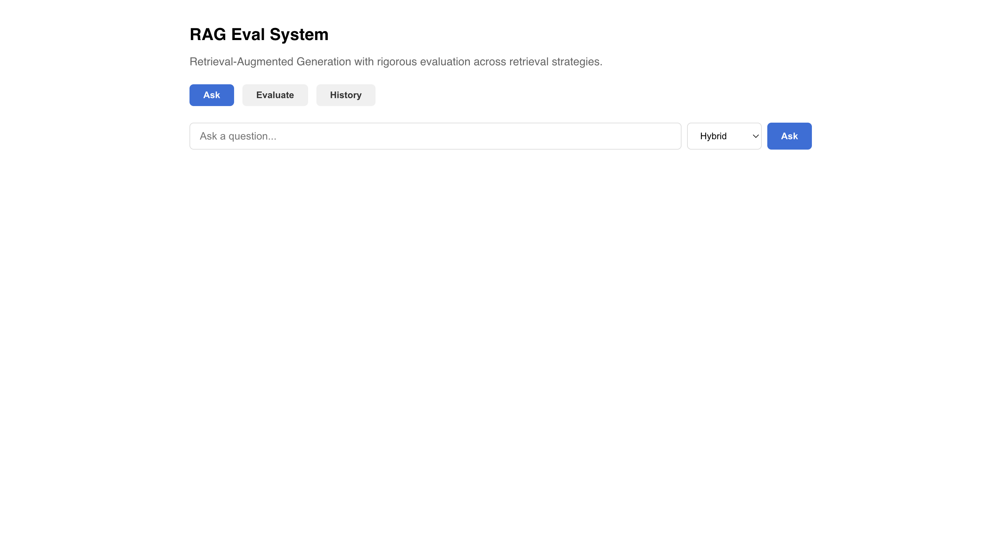

# RAG Eval System

A retrieval-augmented generation system that answers questions over a document corpus with citation-linked responses. The core value is the rigorous evaluation framework that compares five retrieval strategies with statistical significance testing.

## What it does

- Ingests documents (txt/md) into a vector database and BM25 index
- Answers questions using retrieved context passed to Claude, with inline citations
- Compares five retrieval strategies head-to-head with Precision@K, Recall@K, and latency metrics
- Runs paired t-tests to determine whether differences between strategies are statistically significant
- Persists every query, strategy, and answer to SQLite for history and analysis

## Retrieval Strategies

| Strategy | Description |
|---|---|
| Semantic | Embedding similarity via sentence-transformers + Chroma |
| BM25 | Keyword matching with term frequency weighting |
| Hybrid | Weighted combination of semantic + BM25 scores |
| Reranked | Hybrid retrieval reranked by cross-encoder (ms-marco-MiniLM) |
| HyDE | Hypothetical Document Embeddings — Claude generates a hypothetical answer, that is embedded and used for retrieval, then reranked |

## Tech Stack

- **Backend**: Python, FastAPI, SQLite
- **LLM**: Claude API (claude-sonnet-4-6)
- **Embeddings**: sentence-transformers (all-MiniLM-L6-v2, local)
- **Vector DB**: ChromaDB (local, persistent)
- **Reranker**: cross-encoder/ms-marco-MiniLM-L-6-v2
- **Keyword retrieval**: rank-bm25
- **Frontend**: React

## Project Structure
## Setup

```bash
# Backend
python3 -m venv .venv
source .venv/bin/activate
pip install -r requirements.txt

# Add API key
cp .env.example .env
# Edit .env and add your Anthropic API key

# Run backend
uvicorn app.main:app --reload --port 8000

# Ingest documents
curl -X POST http://localhost:8000/ingest

# Frontend
cd frontend
npm install
npm start
```

## API Endpoints

| Method | Endpoint | Description |
|---|---|---|
| POST | /ingest | Ingest documents from data/corpus |
| POST | /retrieve | Retrieve chunks for a query |
| POST | /generate | Generate answer with citations |
| POST | /evaluate | Run full evaluation across all strategies |
| GET | /history | Recent query history |

## Evaluation Methodology

The evaluation harness runs all five retrieval strategies against a labeled test set of 30 question/chunk pairs. For each strategy and question:

- **Precision@K**: fraction of retrieved chunks that are relevant
- **Recall@K**: fraction of relevant chunks that were retrieved
- **Latency**: median and p95 end-to-end retrieval time

A paired t-test on Precision@5 between hybrid and semantic determines whether the hybrid improvement is statistically significant (p < 0.05).

## Results

_To be filled after evaluation run._

| Strategy | Precision@5 | Recall@5 | Latency (median ms) |
|---|---|---|---|
| Semantic | - | - | - |
| BM25 | - | - | - |
| Hybrid | - | - | - |
| Reranked | - | - | - |
| HyDE | - | - | - |

Paired t-test (hybrid vs semantic): p = _

## Frontend


